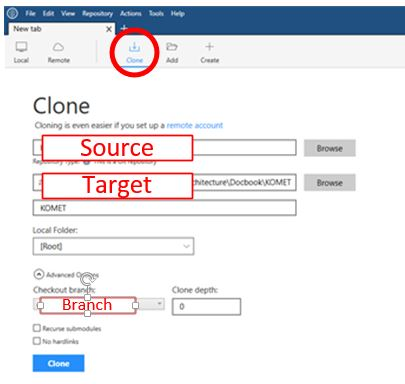
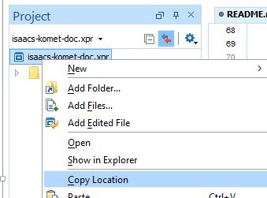
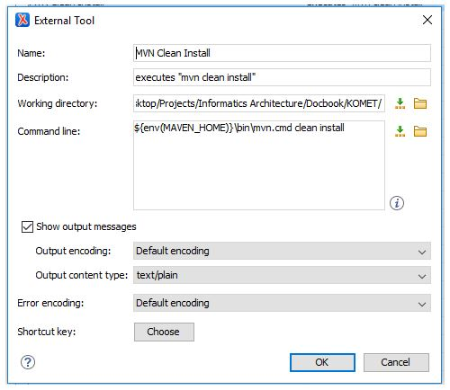
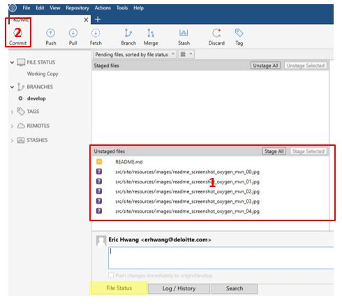
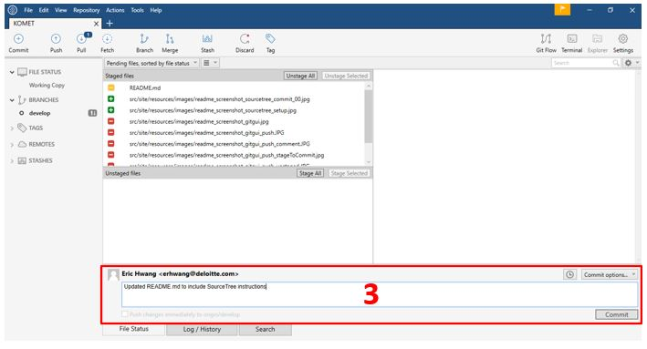
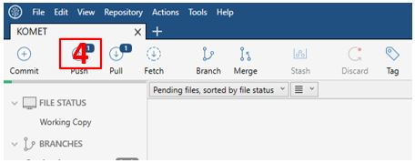
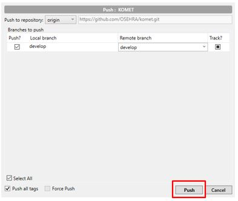

# README #

## What is this repository for? ##

This repository is to provide for collaborative development of documentation for **I**nformatic**S** **A**rchitecture **AC**celeration's (ISAAC) **K**n**O**wledge **M**anagement **E**nvironmen**T** (KOMET). 

## How do I get set up? ##

### Viewing generated KOMET Compendium PDF and HTML files ###
Generated pdf and html files can be found in [informatics-architecture.net](http://informatics-architecture.net/isaacs.komet.web/isaacs-komet-compendium/index.html)

### Setting up to edit Docbook ###
This is a maven/docbook project. To edit docbook XML files, following installations are recommended:

1. JAVA
    + If your machine does not have JAVA, download and install Java SE: [Java Download](http://www.oracle.com/technetwork/java/javase/downloads/index.html)  
&nbsp;
2. Maven
    + Download and unzip from: [Maven Download](https://maven.apache.org/download.cgi)  
&nbsp;
3. SourceTree
    + Download and install from: [Atlassian SourceTree](https://confluence.atlassian.com/get-started-with-sourcetree/install-sourcetree-847359094.html) - Be sure to follow installation instructions from this site
    + Run **Source Tree** and select **Clone**  
        
&nbsp;
        + Source Location
            + get link and copy into **Source Location**
                + Go to [KOMET github](https://github.com/OSEHRA/komet)
                + Select **Clone or download** and copy link:
                    
&nbsp;
        + Target Directory – enter the path of the directory & folder name
        + Branch - be sure it is "develop"
        + Click on **Clone**
        + Close SourceTree once the project has been downloaded  
&nbsp;
4.	Build the clone source code
    + Skip this step if you are not familiar with command prompt operations
    + If you are familiar with command prompt, execute mvn clean install in the directory created in __Target Directory step of SourceTree installation__  
&nbsp;
5.	Oxygen XML Editor
    + Download and install from [Oxygen XML Editor](https://www.oxygenxml.com/)
        + Select File Association – recommend selecting **XML Document**
        + sign up for 30-day evaluation key
    + When you start the program, enter 30-day trial license key:
        
&nbsp;
    + Once opened, Oxygen XML Editor should look like:
        
&nbsp;
    + select **File** > **Open** > go to the folder created in _Target Directory step of Git GUI installation_ > select **isaacs-komet-doc.xpr**  
&nbsp;
    + This step is to set up "mvn clean install" within Oxygen so that it can be executed within Oxygen
        + Right click on **isaacs-komet-doc.xpr** > **Copy Location**            
            
        + go to **Tools** > **External Tools** > **Configure**  
            
        + In the **Preferences** window, click on **New**
        + In the **External Tool** window  
            
            + Name: Enter a name
            + Description: Enter a description
            + Working Directory: paste the copied location of **isaacs-komet-doc.xpr** from above
                + remove **file:/**
                + replace **%20** with a space
                + remove **isaacs-komet-doc.xpr**
            + **Apply** > **OK**
        + You should now have a new button in the toolbar. Press this button to start _mvn clean install_  
            
        + When the process is completed, you will see the icon change from red square to gree 'play' icon  
            
&nbsp;
You are now able to edit files within Oxygen!

### Committing and pushing edited files to GitHub ###
_Note: It is generally a good practice to perform a **mvn clean install** prior to committing/pushing edited files back to GitHub._  

Contact **Keith Campbell** for write priviliges.

1. SourceTree  
&nbsp;      
        
        
        
    + select files or stage all files (1), and press **commit** (2)
    + Enter a comment and press **commit** button below the comment textbox (3)
    + Press **Push** putton (4)
    + Make sure Local and Remote branches are set to "develop" and press the **Push** button  
      